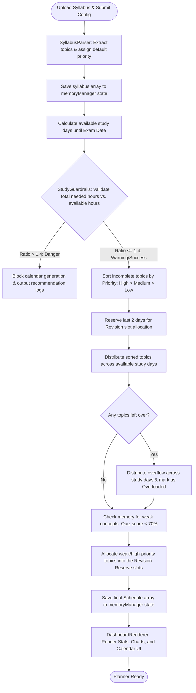
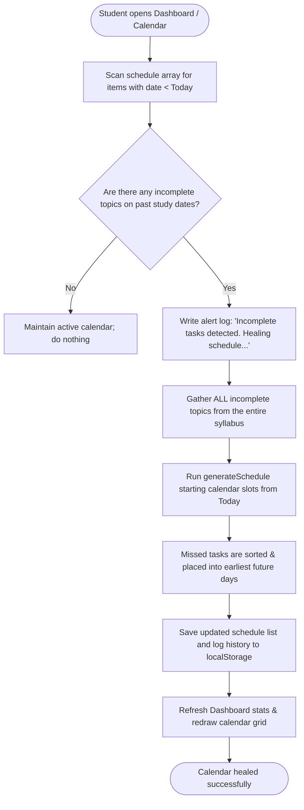

# StudyAgent: The Self-Healing AI Study Planner & Burnout Prevention Agent

## 📌 Project Overview

**StudyAgent** (AI Study Planner Agent) is a client-side study companion built to solve one of the most persistent challenges in modern education: **effective, sustainable exam preparation**. 

Unlike standard calendar apps or static checklist tools that require manual scheduling and fail to adapt when real life disrupts plans, StudyAgent simulates an active, reasoning co-pilot. It digests complex syllabus documents, calculates workload viability against cognitive safety guidelines, constructs prioritized calendars, measures actual topic retention via interactive quizzes, and automatically heals itself when a student falls behind.

Built entirely on native web standards (HTML5, Vanilla CSS3, ES6 JavaScript) and running on a zero-dependency local Node.js server, StudyAgent operates directly in the browser. It stores all user profiles, schedules, quiz histories, and logs securely inside the browser's local storage. This ensures absolute privacy and instant, lightweight responsiveness without relying on expensive server infrastructure.

---

## ❌ The Problem: Why Students Fail to Prepare Effectively

Exam preparation is a high-stress environment plagued by cognitive bottlenecks and behavioral traps. Most students drop their study schedules within the first week due to three main problems:

### 1. The Planning Fallacy & Overestimation Bias
Students are notoriously poor at estimating how long it takes to master academic concepts. When planning, they tend to cluster multiple dense chapters into a single day, ignoring their actual daily availability. This lack of realistic scheduling inevitably leads to academic burnout, fatigue, and eventual abandonment of the plan.

### 2. The Rigid Schedule Trap (Lack of Adaptability)
Traditional planners are static. If a student falls sick, gets distracted, or simply fails to complete scheduled topics on a Tuesday, the calendar remains unchanged. On Wednesday, the student is faced with a choice: double their workload to catch up, or manually shift dozens of calendar items forward. This manual overhead creates **decision fatigue** and "planning paralysis," causing the student to drop the schedule entirely.

### 3. The Illusion of Competence vs. Lack of Active Recall
Reading a textbook or highlighting notes creates a false sense of familiarity. Students believe they "know" a topic because they just read it, only to perform poorly during exams. Passive planners do not verify understanding. Without an active recall loop (like flashcards or quizzes) that feeds directly back into the schedule, students waste time reviewing topics they have already mastered while ignoring weak topics where they are struggling.

---

## 🎯 The Solution: What We Built

StudyAgent addresses these systemic issues by combining dynamic, priority-aware scheduling with strict workload diagnostics, active recall assessment, and self-healing automation.

```
+-----------------------------------------------------------------------+
|                            StudyAgent SPA                             |
|                                                                       |
|  [ Upload Syllabus ] ---> [ Guardrail Diagnostic ] ---> [ Generate ]  |
|                                                                       |
|  [ Active Dashboard ] <--- [ Self-Healing Scheduler ] <--- [ Logs ]   |
|                                                                       |
|  [ Recall Quizzes ] ----> [ Score < 70% Flag ] ----> [ Revision Slot ] |
+-----------------------------------------------------------------------+
```

### 1. Intelligent Syllabus Ingestion & Structuring
Students upload syllabus documents (`.pdf`, `.docx`, `.txt`) or paste raw curriculum guidelines directly. A rules-based parser isolates bullet points, numbered items, and chapter headers to compile a clean, structured topic database. Since client-side parsing of binary PDF/DOCX files is traditionally heavy, the agent implements a simulated layout scanner that reads metadata and generates structured subjects matching the document's context (e.g., Computer Science, Calculus, Physics, World History).

### 2. The Burnout Guardrails Diagnostician
Before any calendar is generated, the agent runs a quantitative sanity check on the inputs. Assigning a baseline of **1.5 hours** of focused study per topic, it checks the ratio of total hours required to the available hours:
$$\text{Workload Ratio} = \frac{\text{Topics to Study} \times 1.5 \text{ hours}}{\text{Available Days} \times \text{Available Hours/Day}}$$

* **Safe Mode ($\le 1.0$x)**: Plentiful time exists. The schedule is generated.
* **Warning Mode ($1.0\text{x} - 1.4\text{x}$)**: The plan is tight and demanding. The planner issues warnings and suggests actions, such as increasing study hours or focusing on high-priority topics.
* **Danger/Blocked Mode ($> 1.4\text{x}$)**: The agent blocks schedule generation to protect the student from burnout. It forces a adjustment of parameters (delaying the exam, increasing daily hours, or trimming down the syllabus to focus on high-priority items).

### 3. Self-Healing Scheduling Algorithm
The scheduling engine prioritizes topics (High > Medium > Low) and distributes them across the available calendar days, capping daily items according to the student's study window. 
Crucially, **the planner checks past dates for incomplete items**. If it finds them, it automatically triggers a self-healing sequence, shifting the past-due topics into the earliest available future slots. The student never has to manually rearrange their schedule.

### 4. Recall Assessment & Revision Reserve
Rather than relying on self-reporting, StudyAgent tests the student's retention. Users launch a quiz directly from any study block. The system loads relevant multiple-choice questions from its local database or generates dynamic concept-checks using templates.
* **Pass ($\ge 60\%$)**: The topic is checked off and marked as complete.
* **Fail/Review ($< 70\%$)**: If the score is low, the topic is flagged as a "weak concept." The agent automatically books slots for these weak topics in the final **revision reserve window** (the 2 days immediately preceding the exam).

### 5. Transparent Reasoning Terminal
To bridge the gap between automated planning and user confidence, StudyAgent displays its thinking process inside a simulated terminal console (`study_agent_reasoning_console.sh`). Students see live logs of the agent's calculations: sorting topics, flagging guardrail violations, identifying missed deadlines, and allocating revision slots.

---

## 📸 Guided Walkthrough & User Interface Showcase

StudyAgent features a premium, responsive glassmorphism user interface designed with Vanilla CSS variables, high-contrast typography, and micro-animations that make scheduling feel alive and engaging.

### 1. Dashboard (The Control Center)
Upon logging in, students are greeted with their personalized dashboard. 


*Figure 1: The Primary Dashboard view showing progress metrics, days remaining, streaks, and recall averages.*

* **Syllabus Completion Ring**: A dynamic SVG circular progress indicator that grows as topics are checked off.
* **Active Streak Meter**: Tracks consecutive days of learning activity, displaying a glowing flame icon to keep the student motivated.
* **Average Quiz Score**: Highlights overall recall health across all completed assessments.
* **Revision Allocator Panel**: Dynamically displays weak topics that have been flagged for exam-eve review sessions.
* **Analytical charts**: Provide a categorical visual breakdown of syllabus progress.

---

### 2. Syllabus Upload & Guardrails Diagnostic
This screen handles subject configuration, file uploads, and active safety assessments.


*Figure 2: Syllabus Configurator displaying the drag-and-drop zone and the Guardrails assessment panel blocking an unrealistic setup.*

* **Configurator Form**: Collects the subject name, exam date, daily hour limits, and default priority.
* **Document Dropzone**: Accepts files and displays simulated parser logs while extracting topics.
* **Diagnostic Console**: Computes the workload ratio. In Figure 2, the agent has detected an unrealistic schedule, blocked timetable generation, and provided three recommendations to fix the plan.

---

### 3. Study Planner & Reasoning Console
The heart of the agent's scheduling and adaptation mechanics.


*Figure 3: Calendar grid featuring study cards, quiz launchers, and the live agent reasoning console logs.*

* **Reasoning Console**: A terminal window displaying the step-by-step thinking process of the agent during calendar generation.
* **Timetable Cards**: Interactive slots organized by date. Each card allows students to mark the topic as complete or launch the corresponding review quiz.
* **Revision Reserve**: Separately highlighted blocks showing slots booked for weak concepts.

---

### 4. Interactive Quiz Assessment
The recall module evaluates topic mastery.


*Figure 4: Active multiple-choice quiz screen with real-time feedback and explanation cards.*

* **Progress Bar**: Shows current progress through the 3-question evaluation card.
* **Interactive Options**: High-contrast buttons with immediate green/red success indicators.
* **Concept Explanations**: Expands upon submission to explain *why* an answer is correct, reinforcing active learning.

---

### 5. Progress Insights & Activity Ledger
A ledger detailing historical attempts and progress charts.


*Figure 5: Historical log of quiz attempts, active streaks, and analytical data charts.*

* **Quiz History Table**: A ledger detailing every quiz attempt, including scores, percentages, and timestamps.
* **Activity Streak Ledger**: Monitors consecutive days of study checklist updates or quiz submissions.

---

## 📐 System Architecture & Module Details

StudyAgent is engineered around a clean, single-page application (SPA) model. The codebase separates UI rendering, central state memory, parsing heuristics, scheduling math, safety guardrails, and assessment coordination.

```
       +---------------------------------------------+
       |                  INDEX.HTML                 |
       +----------------------|----------------------+
                              |
                     +--------v--------+
                     |     MAIN.JS     |  <-- Controller & Bindings
                     +--------|--------+
                              |
         +--------------------+--------------------+
         |                                         |
+--------v--------+                       +--------v--------+
|    MEMORY.JS    | <--> LocalStorage     |  DASHBOARD.JS   | <-- Renders Charts &
+-----------------+                       +-----------------+     Calendar Layouts
         |                                         |
         |                                         |
+--------v--------+                       +--------v--------+
|    PARSER.JS    |                       |   PLANNER.JS    | <-- Self-Healing
+-----------------+                       +--------+--------+     Scheduling Loop
         |                                         |
         |                                         |
+--------v--------+                       +--------v--------+
|    QUIZ.JS      | <--> questions.js     |  GUARDRAILS.JS  | <-- Safety Ratio
+-----------------+      (Question Bank)  +-----------------+     Check
```

### Module Design & Code Implementation

#### 1. Central Memory & Event Bus (`js/memory.js`)
Rather than passing props down complex nested layers, StudyAgent leverages a centralized `MemoryManager`. It exposes state reading and writing functions and broadcasts state changes using custom window events.

```javascript
class MemoryManager {
  constructor() {
    this.state = this.loadState();
  }

  loadState() {
    const data = localStorage.getItem("ai_study_planner_state");
    return data ? JSON.parse(data) : { ...DEFAULT_STATE };
  }

  saveState() {
    localStorage.setItem("ai_study_planner_state", JSON.stringify(this.state));
  }

  addLog(phase, message) {
    const timestamp = new Date().toLocaleTimeString();
    this.state.logs.push({ timestamp, phase, message });
    this.saveState();
    // Broadcast event so the Reasoning Console updates instantly
    window.dispatchEvent(new CustomEvent("agent-log-added", { detail: { timestamp, phase, message } }));
  }
}
```

#### 2. Workload Evaluator (`js/guardrails.js`)
The `StudyGuardrails` class acts as the safety gatekeeper. By analyzing the topic count against the calendar window, it calculates the burnout ratio and yields detailed user recommendations:

```javascript
class StudyGuardrails {
  static HOURS_PER_TOPIC = 1.5;

  static validatePlan(topicCount, daysRemaining, hoursPerDay) {
    if (topicCount <= 0) return { isRealistic: true, severity: "success", message: "No topics loaded." };
    if (daysRemaining <= 0) return { isRealistic: false, severity: "danger", message: "Invalid date." };

    const totalHoursNeeded = topicCount * this.HOURS_PER_TOPIC;
    const totalHoursAvailable = daysRemaining * hoursPerDay;
    const ratio = totalHoursNeeded / totalHoursAvailable;
    const recommendations = [];

    if (ratio <= 1.0) {
      return { isRealistic: true, severity: "success", message: "Plan is highly realistic!" };
    } else if (ratio <= 1.4) {
      recommendations.push(`Increase daily study hours to ${Math.ceil(totalHoursNeeded / daysRemaining)}h.`);
      recommendations.push(`Or postpone your exam date by at least ${Math.ceil(totalHoursNeeded / hoursPerDay) - daysRemaining} days.`);
      return { isRealistic: true, severity: "warning", message: "Plan is tight.", recommendations };
    } else {
      recommendations.push(`CRITICAL: Focus only on high priority chapters to reduce required hours.`);
      recommendations.push(`Or delay your target exam date to prevent academic burnout.`);
      return { isRealistic: false, severity: "danger", message: "Plan is highly UNREALISTIC!", recommendations };
    }
  }
}
```

#### 3. Self-Healing Planner Engine (`js/planner.js`)
The planner utilizes a clean two-step process to maintain chronological order and adapt schedules.
1. **Syllabus Categorization & Sorting**: Incomplete topics are sorted by priority (`high` > `medium` > `low`).
2. **Dynamic Slot Generation**: The planner iterates through available days, placing sorted topics into calendar slots up to the daily capacity limit. If topics overflow, they are distributed across study days, and the console alerts the user of the excess workload.
3. **Deadlines Healing (Check & Replan)**:
   This function runs whenever the student visits their calendar. It sweeps the schedule, searching for past dates with uncompleted items:

```javascript
static checkAndReplan() {
  const state = window.memoryManager.state;
  if (!state.schedule || state.schedule.length === 0) return false;

  const todayStr = new Date().toISOString().split("T")[0];
  let missedTasksCount = 0;

  state.schedule.forEach(day => {
    if (day.date < todayStr && !day.isRevision) {
      day.topicIds.forEach(topicId => {
        const topic = state.syllabus.topics.find(t => t.id === topicId);
        if (topic && !topic.completed && !day.completed.includes(topicId)) {
          missedTasksCount++;
        }
      });
    }
  });

  if (missedTasksCount > 0) {
    window.memoryManager.addLog("Memory Adaptation", `Detected ${missedTasksCount} incomplete task(s) from past dates.`);
    window.memoryManager.addLog("Memory Adaptation", "Initiating automatic replanning sequence...");
    // Regenerating schedule automatically absorbs incomplete topics and pushes them forward!
    this.generateSchedule();
    return true;
  }
  return false;
}
```

#### 4. Syllabus Text & Simulated OCR Scanner (`js/parser.js`)
The parser cleans raw text inputs by matching regex patterns like `^(?:Module|Chapter|Unit|\d+)\s*[:.-]?\s*(.+)$` to isolate topic names. If a PDF or DOCX file is loaded, the scanner mimics a binary parser. It logs intermediate steps—like zip-archive inspections and layout markers—to the console and yields structured courses matching common school topics (Calculus, Computer Science, Mechanics) based on the file name.

#### 5. Recall Module (`js/quiz.js`)
The quiz manager links scheduling with assessment performance. When a student initiates a quiz, the engine loads questions from `data/questions.js`. If there is no subject match, it generates custom questions based on templates. When the quiz is completed, the manager writes the final grade back to the topic object:
* **Score $\ge 60\%$**: The topic's `completed` status becomes `true`.
* **Score $< 70\%$**: The topic is flagged as weak. The next scheduling pass pulls this topic ID and assigns it to dedicated slots during the pre-exam revision reserve dates.

---

## 🔄 Step-by-Step Logic Flowcharts

### 1. Complete Study Plan Generation Flow
This flowchart maps out the complete execution sequence when a student uploads a syllabus and generates a plan:



### 2. Self-Healing replanning Cycle
This flowchart illustrates how the system detects delays and corrects the study calendar automatically:



---

## 💎 Value Proposition & User Impact

StudyAgent transforms exam preparation from a source of stress into a structured, manageable workflow:

1. **Academic Safety Net (Anti-Burnout)**: By calculating workload viability beforehand, the app prevents students from committing to impossible schedules. It encourages realistic goal-setting and study habits.
2. **Zero Maintenance (Self-Healing)**: Students no longer have to waste time updating spreadsheets or calendars. The system absorbs missed tasks and updates itself automatically.
3. **Optimized Revision (Active Recall)**: Instead of rereading notes, students focus their final study sessions on concepts they struggled with during quizzes. This targeted approach yields higher retention rates.
4. **Enhanced Privacy & Portability**: Runs locally with zero database subscriptions or third-party cookies. All information remains on the student's device.

---

## 🚀 Setup & Launch Instructions

To launch the project on your local machine, follow these steps:

### System Requirements
* Make sure you have [Node.js](https://nodejs.org/) installed (v12+).

### Launching the Web App

1. **Clone or Download the Project**:
   ```bash
   git clone <repository-url>
   cd capstone-2
   ```

2. **Start the Local Server**:
   Run the static Node.js server to host the local files:
   ```bash
   node server.js
   ```

3. **Access the Interface**:
   Open your browser and navigate to:
   [http://localhost:8080](http://localhost:8080)

4. **Interacting with the App**:
   * Navigate to **Upload Syllabus**, input your exam parameters, drag a syllabus text file (or type in the text box), and click **Compile & Generate**.
   * Go to **Study Planner** to see your schedule, check off topics, or start quizzes.
   * View **Dashboard** and **Progress** tabs to watch your completion percentages, quiz scores, and streaking flame update dynamically.
