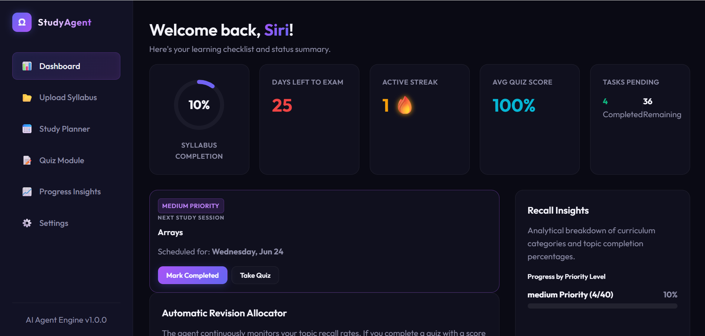
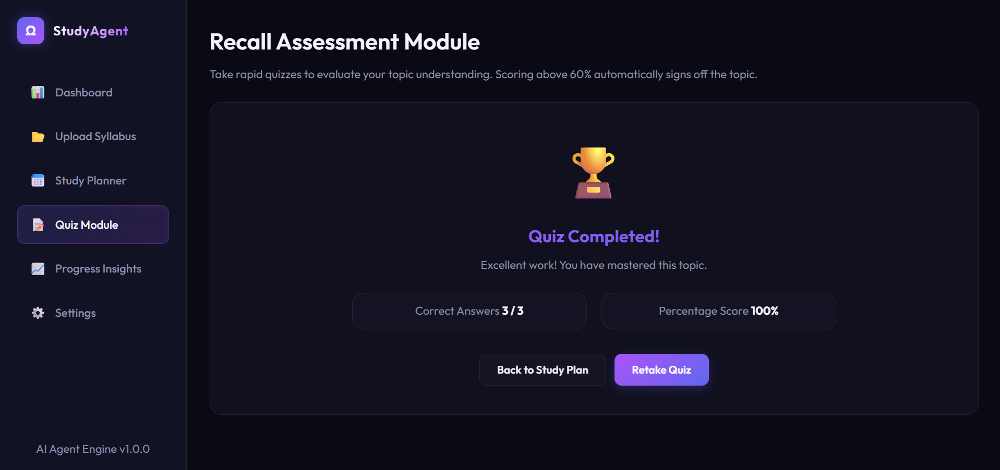
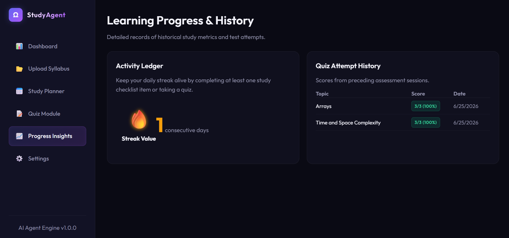
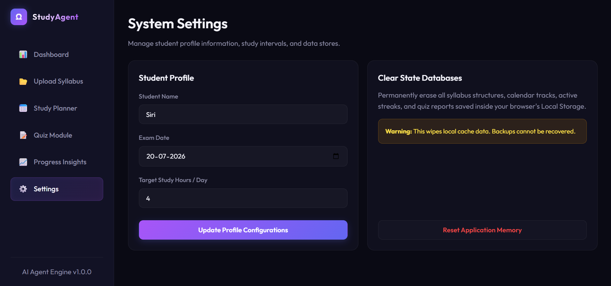
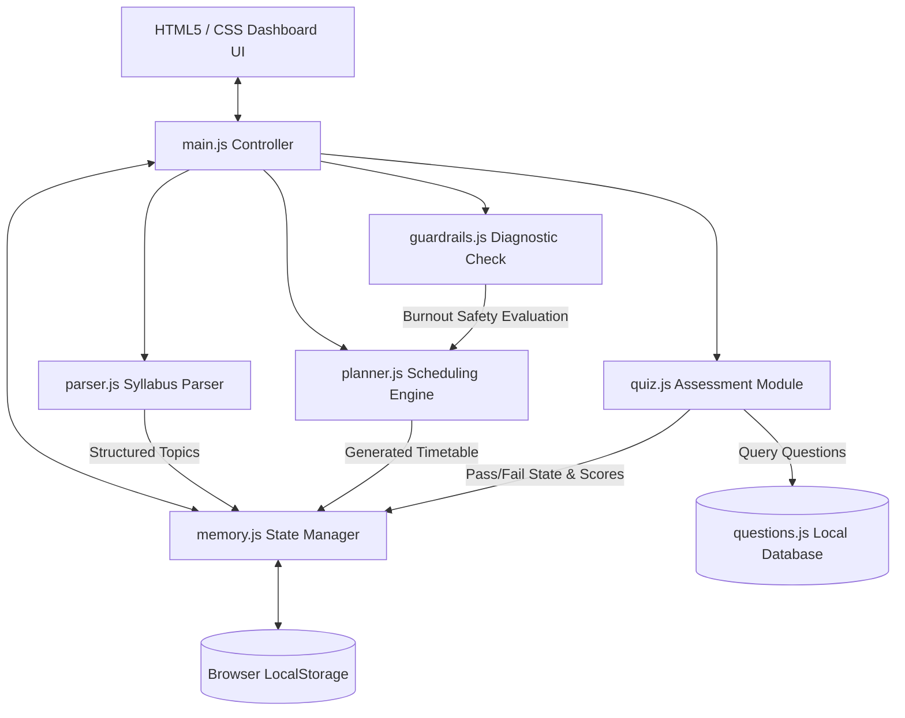
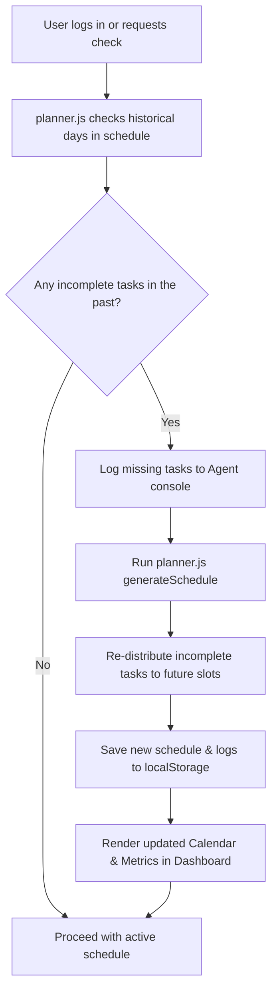
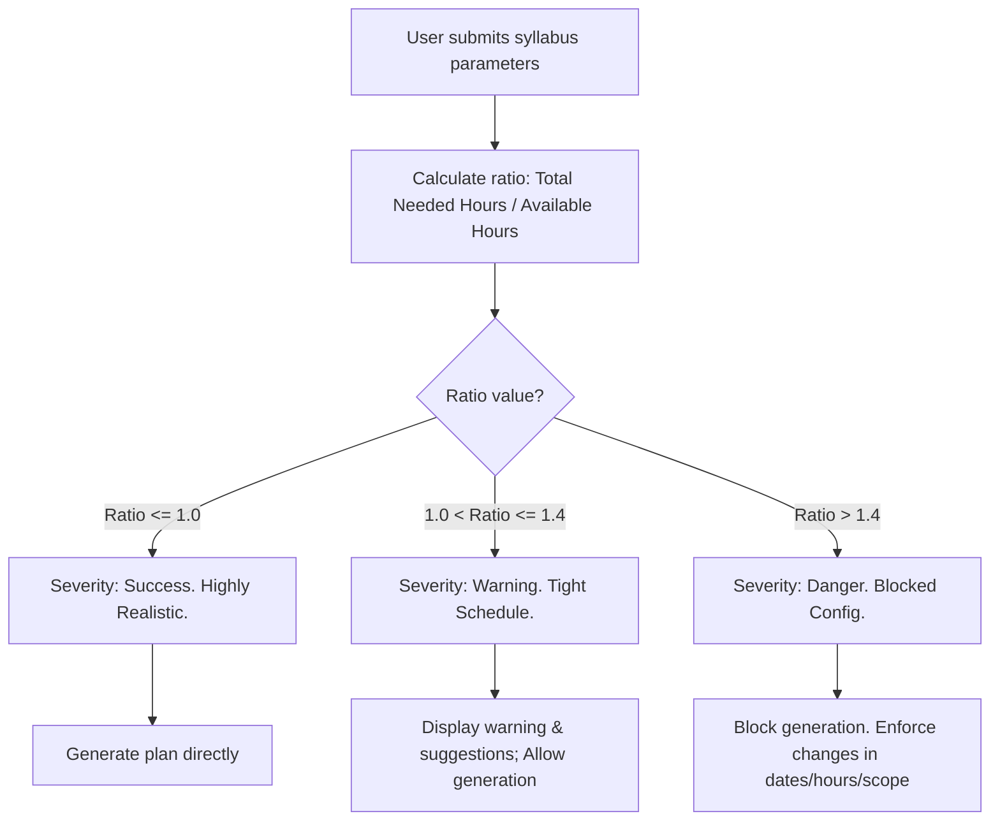

# AI Study Planner Agent 🎓🚀

AI Study Planner Agent (**StudyAgent**) is an interactive, browser-based SPA study assistant powered by a client-side agentic engine. It is designed to tackle the common pitfalls of exam preparation: academic burnout, decision fatigue, static schedules, and poor recall retention. 

By analyzing syllabus topics, exam dates, daily study limits, and quiz performance, StudyAgent crafts, diagnostic-checks, and auto-adapts personalized schedules using a self-healing replanning cycle.

---

## 📸 Application Showcase

<p align="center">
  
  
</p>
<p align="center">
  
  
</p>
<p align="center">
  
  
</p>

---

## ❌ The Problem

Traditional study planners and calendars are static sheets that suffer from several critical design flaws:
1. **Burnout Risks**: Students overload their study days without calculating whether they physically have enough hours to cover the content, leading to stress and eventual abandonment of the plan.
2. **Rigidity (No Self-Healing)**: Life happens. If a student misses a couple of chapters, a traditional planner remains unchanged, causing "planning paralysis" as the schedule grows increasingly out of sync with reality.
3. **No Active Recall Loop**: Rote reading does not equal comprehension. Planners rarely track *how well* a student knows a topic or force structured revisions for concepts they failed to grasp.
4. **Opaque Logic**: Automated calendars often make decisions behind closed doors, leaving students confused as to why certain topics are placed on specific days.

---

## 🎯 The Solution: StudyAgent

StudyAgent resolves these pain points through an active client-side agent simulator:

* **Syllabus Parsing & Extraction**: Parses plain text or simulates OCR extraction on documents (`.txt`, `.pdf`, `.docx`) to isolate individual topics and modules automatically.
* **Workload Guardrails Diagnostic**: Evaluates planning inputs (`Study Hours needed` vs. `Available Calendar Hours`) before generation. If the ratio exceeds **1.4x**, the agent flags the configuration as **UNREALISTIC** to prevent burnout, providing recommendations (e.g., postpone exam, drop low priority topics, increase hours).
* **Self-Healing Adaptive Replanning**: If the system detects incomplete study cards in the past, it automatically triggers a rescheduling pass. It seamlessly shifts past missed topics into future slots without manual intervention.
* **Quiz Assessments & Revision Slot Allocation**: Integrates an evaluation engine. If a student scores below **70%** on a topic quiz, the agent classifies it as "weak" and schedules dedicated review sessions during the final exam revision window.
* **Transparent Agent Reasoning Console**: Embeds a live terminal interface (`study_agent_reasoning_console.sh`) that logs the agent's calculations, prioritization logic, guardrail blocks, and active schedule repairs.

---

## 🏗️ Architecture

StudyAgent is built using a modern, decoupled client-side architecture with zero external package dependencies. It is served locally via a minimal Node.js server.

### System Components



### Module Breakdown

1. **`server.js`**: A lightweight Node.js HTTP server configured with appropriate MIME types. It serves static assets and shields the application from directory traversal.
2. **`js/memory.js` (Memory Manager)**: Serves as the single source of truth. Persists the state (profile, syllabus, generated calendar, streaks, quiz logs) to the browser's `localStorage`. Dispatches custom window events on state updates.
3. **`js/parser.js` (Syllabus Parser)**: Extracts lists of topics based on typical numbering/module formats, and includes a file processor simulating PDF/DOCX layouts based on file names.
4. **`js/planner.js` (Planner Engine)**: Categorizes, prioritizes, and maps study slots to calendar dates. It reserves final dates for revisions and handles overflow scheduling.
5. **`js/guardrails.js` (Guardrails Module)**: Conducts quantitative sanity checks. Establishes severity thresholds (Success, Warning, Danger) to guide user choices.
6. **`js/quiz.js` (Quiz Manager)**: Coordinates test sessions, scores evaluations, automatically checks off passed topics (score $\ge$ 60%), and signals revision requirements.
7. **`js/dashboard.js` (Dashboard Renderer)**: Directs standard UI rendering tasks, calculates circular progress indicators, updates streaks, and populates analytical data tables.
8. **`js/main.js` (Main Controller)**: Binds page elements, switches views, handles mock dropzones, and initializes controllers.

---

## 🔄 Core Agent Logic Flows

### 1. The Self-Healing / Auto-Replan Loop

Whenever the dashboard loads or is forced to refresh, the planner reviews historical schedule items to identify overdue tasks and automatically repairs the calendar:



### 2. Workload Assessment & Guardrail Feedback Loop

Before generating schedules, the guardrails analyze capacity to protect the user's study limits:



---

## ⚙️ Instructions for Setup

The application is built on top of native web standards, requiring **zero package installs** (no `npm install` needed).

### Prerequisites
* [Node.js](https://nodejs.org/) installed (v12 or higher).

### Quick Start

1. **Clone the Repository**:
   ```bash
   git clone <repository-url>
   cd capstone-2
   ```

2. **Launch the Server**:
   Run the static node server included in the root directory:
   ```bash
   node server.js
   ```

3. **Open the Application**:
   Navigate to the URL printed in the console:
   [http://localhost:8080](http://localhost:8080)

4. **Reset State (Optional)**:
   If you ever want to reset the planner metrics, open the **Settings** page in the application and click the **Reset All Data** button.

---

## 📚 Technical Stack

* **Front-end**: Standard HTML5, Native Web APIs.
* **Styling**: Vanilla CSS3 (Custom grid designs, glassmorphism templates, responsive layout variables, variables for dark mode theme context).
* **Logic Layer**: Modular Vanilla ES6 JavaScript.
* **Backend**: Lightweight Node.js `http` module.
* **Storage**: Local Storage API.
